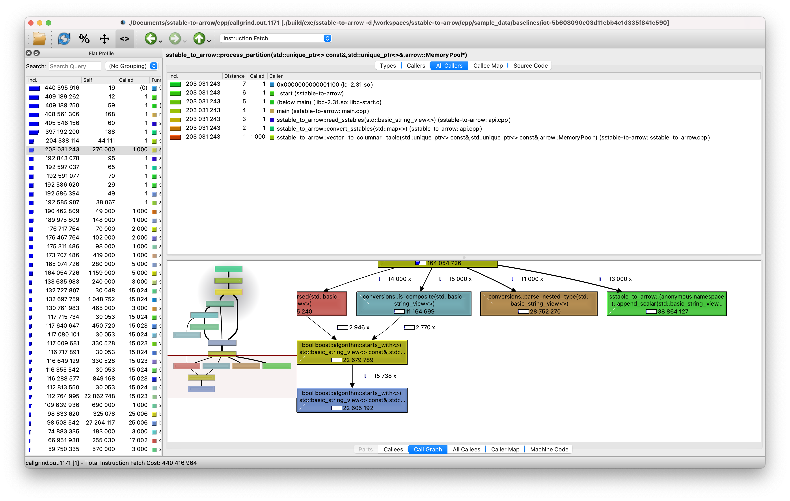

# sstable-to-arrow

This directory contains the source code for sstable-to-arrow.

## How to run

This project can be run through a [Docker](https://www.docker.com/) container via:
```bash
docker run --rm --name sstable-to-arrow datastaxlabs/sstable-to-arrow
```

The above command will print out a help function and exit. Below is a more complex example which reads SSTables from your local filesystem and forwards port 9143 from inside the container:
```bash
# replace /path/to/sstable/directory with the path to the directory with your sstables
docker run --rm -itp 9143:9143 -v /path/to/sstable/directory:/mnt/sstables --name sstable-to-arrow datastaxlabs/sstable-to-arrow /mnt/sstables
```

This will listen for a connection on port 9143. It expects the client to send a
message first, and then it will send data in the following format:

1. The number of Arrow Tables being transferred, an 8-byte big-endian unsigned integer
2. For each table:
    1. Its size in bytes as an 8-byte big-endian unsigned integer
    2. The contents of the table in Arrow IPC Stream Format

sstable-to-arrow can also save the SSTable data as a Parquet file by passing the `-p` flag along with the destination file path. Read the full usage details by running `sstable-to-arrow -h`.

To get SSTables, you can download IOT (Internet of Things) sample data generated by [NoSQLBench](http://docs.nosqlbench.io/#/) [at this Google Drive folder](https://drive.google.com/drive/folders/1y-f6rRH3OfC8AvVTNuhcmvjihnaMWN4p?usp=sharing). You can also generate IOT data using the script at [../test/generate-data](../test/generate-data), or you can manually create a table using CQL and the Cassandra Docker image using the steps below. See [the Cassandra quickstart](https://cassandra.apache.org/quickstart/) for more info.

## Building from source

With the Visual Studio Code [Remote - Containers](https://marketplace.visualstudio.com/items?itemName=ms-vscode-remote.remote-containers) extension installed, you can open this folder in VS Code, run `Open Folder in Container` from the command palette, and select this folder to run the project within a Docker container. This will read the configuration from the `Dockerfile` and install all of the dependencies for you inside the isolated container.

If not using Docker, you can manually build the project as follows, though installation of dependencies may vary from machine to machine. You can see the [Dockerfile](Dockerfile) for example commands on a Ubuntu machine. This project has a number of dependencies, which we recommend installing in the following order:

1. Python 3 with NumPy installed.
2. [Kaitai Struct](`https://kaitai.io/#download`) and the [Kaitai Struct C++/STL runtime library](https://github.com/kaitai-io/kaitai_struct_cpp_stl_runtime).
3. A number of [Boost libraries](https://www.boost.org/doc/libs/). Although they strongly recommend using the Boost.Build build system, this project assumes the standard `g++` compiler, which means that installing Boost.Python may end up being quite difficult. See the [Dockerfile](Dockerfile) for example commands on a Ubuntu machine.
    - [Boost.Iostreams](https://www.boost.org/doc/libs/1_77_0/libs/iostreams/doc/index.html).
    - [Boost.Filesystem](https://www.boost.org/doc/libs/1_77_0/libs/filesystem/doc/index.htm).
    - [Boost.Python](https://www.boost.org/doc/libs/1_77_0/libs/python/doc/html/building/installing_boost_python_on_your_.html).
4. [Apache Arrow (Python)](http://arrow.apache.org/docs/developers/python.html), which depends on Python 3, NumPy, and Arrow C++. The linked guide will walk you through installing all of these. Specifically, make sure that when installing Arrow C++, you include the [optional components](http://arrow.apache.org/docs/developers/cpp/building.html#optional-components) that are required for this project: `ARROW_PARQUET`, `ARROW_S3`, and `ARROW_PYTHON`.

Once you have all the dependencies installed, you can build this project using CMake:
```bash
mkdir build
cd build
cmake .. # or if using ninja: cmake -GNinja ..
make # or: ninja
```

The final executable will then be located at `build/exe/sstable-to-arrow`, which you can run from the build folder via `./exe/sstable-to-arrow`. See the previous section for options and how to run.

## Development details

This project consists of a number of subprojects, described below.

### 1. `parser`

`parser/` is the a sub-library used to parse SSTable files (the data format used by Cassandra) using the [Kaitai Struct](https://kaitai.io/) declarative language to read the file and store the data in a Kaitai Struct object.

#### A brief overview of Kaitai

Kaitai Struct is a declarative language to describe binary structures. This means that we express the format of the binary file using YAML in a Kaitai Struct (`.ksy`) file. The `.ksy` files for this project are stored in `parser/ksy`. Then, the `kaitai-struct-compiler` command line tool compiles these files into a given programming language (C++ for this project). The generated C++ class can then be instantiated using an input stream to parse the data from that stream into the structure specified by the `.ksy` file.

Kaitai also allows the use of "opaque types", or types that are defined outside of Kaitai and included in the compiled Kaitai class. These are used to handle pieces of the binary format which cannot be parsed as easily. There are a number of opaque types, defined in `parser/opaque`, used to parse the Cassandra `Data.db` file.

Unfortunately, Kaitai doesn't include any error handling in the generated classes, and it assumes that the stream passed is in the specified format.

### 2. `sstable-to-arrow`

The actual `sstable-to-arrow` library is contained within the `src` directory. Be warned that error handling and logging are extremely rudimentary. All of the code exists under the `sstable_to_arrow` namespace. Here's a brief overview of what each file does:

- `api.cpp/.h` contains `read_sstable(...)` to read SSTables from a given path.
- `conversion_helper.cpp/.h` contains the `conversion_helper_t` class, which is an intermediate stage between the Kaitai Struct object parsed from the SSTable files and the Arrow Table which it ultimately outputs via `to_table()`.
- `inspect_files.cpp/.h` is a dummy file for debugging SSTable files. It currently only supports statistics and data files and is not meant for users.
- `io.cpp/.h` contains the logic for sending Arrow Tables across a network or writing them to a Parquet file.
- `opts.cpp/.h` contains the `flags` object to configure global library settings, as well as a few utilities for getting the list of file paths corresponding to a single SSTable.
- `sstable_to_arrow.cpp/.h` contains the main logic for iterating through the Kaitai Struct representation of an SSTable and converting it into an Arrow Table.
- `sstable.cpp/.h` contains a helper class for reading from file streams and decompressing the `Data.db` file.

### 3. `exe`

This project only contains `cli_args.cpp/.h` files for reading command line arguments and a `main.cpp` file which is a command line tool to call the `sstable-to-arrow` library.

### 4. `python`

This is a rudimentary shared library which exposes a limited set of `sstable-to-arrow` to Python through Boost.Python. Namely, it allows the user to run code like:

```py
import sstable_to_arrow
tables = sstable_to_arrow.read_sstables("/path/to/sstable/directory")
# tables now contains a list of `pyarrow.Table`s
```

## Profiling

You can profile this project using Valgrind's [Callgrind](https://www.valgrind.org/info/tools.html#callgrind) tool along with [KCacheGrind](https://kcachegrind.github.io/html/Home.html) (or QCacheGrind):

```bash
valgrind --tool=callgrind ./build/exe/sstable-to-arrow -d ./sample_data/baselines/iot-5b608090e03d11ebb4c1d335f841c590
# callgrind will generate a file with a filename in the format below
# you can use kcachegrind instead if you have it installed
qcachegrind ./callgrind.out.1234
```

This will open a GUI where you can observe the code branching and performance of each individual function call:



## Limitations and caveats

- sstable-to-arrow does not do deduping. It sends each individual SSTable as an Arrow Table. The user must configure a cuDF per sstable and use the GPU to merge the sstables based on last write wins semantics. sstable-to-arrow exposes internal cassandra timestamps so that merging can be done at the cuDF layer. Support for tombstones is currently under development.
- Some information, namely the names of the partition key and clustering columns, can't actually be deduced from the SSTable files, so they are represented in the final Arrow Table as simply `partition key` and `clustering key`.
- Cassandra stores data in memtables and commitlog before flushing to sstables, so analytics performed via only sstable-to-arrow will potentially be stale / not real-time.
- Currently, the parser has only been tested with SSTables written by Cassandra OSS 3.11. These *should* be identical to SSTables written by Cassandra 3.x.
- The system is set up to scan entire sstables (not read specific partitions). More work will be needed if we ever do predicate pushdown.
- Limitations with types:
- The following cql types are not supported: `counter`, `frozen`, and user-defined types.
- `varint`s can only store up to 8 bytes. Attempting to read a table with larger `varint`s will crash.
- The parser can only read tables with up to 64 columns.
- `decimal`s are converted into an 8-byte floating point value because neither C++ nor Arrow has native support for arbitrary-precision integers or decimals like of the Java `BigInteger` or `BigDecimal` classes. This means that operations on decimal columns will use floating point arithmetic, which may be inexact.
- `set`s are treated as lists since Arrow has no equivalent of a set.
- cuDF only implements a subset of Apache Arrow, so some types in Arrow are not yet supported in cuDF. By passing the `-g` flag, you can pass the raw bytes for most of these data types as a hexadecimal string instead.
- UUIDs in collections are not supported.

## TODO

- Fix or improve limitations above
    - Add support for row tombstone markers
- Improve error handling system and logging system
- Improve documentation and user friendliness with the CLI
- Improve Python bindings
- Refactor to allow conversion of larger-than-memory SSTables
- Include support for SSTables written by DSE (DataStax Enterprise)
